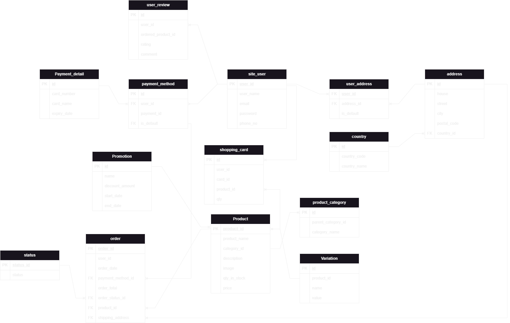

# Database Design for a New System

Designing a database for a new system involves several key steps to ensure **efficiency, scalability, and reliability**. Below are the steps to design a database for a new system.

## 📌 Steps for Database Design

### 1️⃣ Identify Requirements

- Gather business and system requirements.
- Understand user needs and constraints.

### 2️⃣ Conceptual Data Modeling

- Identify **entities** and their **attributes**.
- Define relationships between entities.

### 3️⃣ Entity-Relationship Diagram (ERD)

- Create an ERD to **visualize the structure** of the database.
- Identify **primary keys (PKs) and foreign keys (FKs)**.

### 4️⃣ Normalize the Data Model

- Apply **normalization techniques** (1NF, 2NF, 3NF) to **eliminate redundancy**.

### 5️⃣ Define Tables and Columns

- Convert the ERD into **actual database tables** with appropriate **data types**.

### 6️⃣ Establish Relationships

- Define **one-to-one (1:1), one-to-many (1:M), and many-to-many (M:M)** relationships.

### 7️⃣ Implement Indexes

- Add **indexes** to optimize query performance.

### 8️⃣ Test and Iterate

- Test the database with **real-world scenarios** and optimize for performance.

---

## 📋 System Requirements

### 🔹 **User Management**

- **Create Accounts:** Users can register and log in.
- **Contact Details:** Store **name, email, and phone number**.
- **Addresses:** Users can add **multiple addresses** and set a default.
- **Payment Methods:** Support for **multiple payment methods**.

### 🔹 **Product Management**

- **Products:** The system can store a **large number of products**.
- **Categories:** Products belong to **categories and subcategories**.
- **Product Variations:** Variations include **color, size, etc.**
- **Number in Stock:** Maintain **inventory tracking**.

### 🔹 **Shopping & Orders**

- **Shopping Cart:** Users can add products before checkout.
- **Payment Details for Order:** Users provide **payment and shipping details**.
- **Shipping Method:** Choose from a list of shipping methods.
- **Order Status:** Track order progress (**processing, in delivery, delivered**).

### 🔹 **User Interaction**

- **Reviews:** Users can leave reviews with **ratings (1-5) and comments**.
- **Promotions:** Discounts can be applied to **specific products or categories**.

---

## 📌 Database ERD

Below is a visual representation of the database structure:



---

### 🚀 **How to Use**

1. Clone the repository:
   ```sh
   git clone https://github.com/e_commerce_database_design.git
   ```
